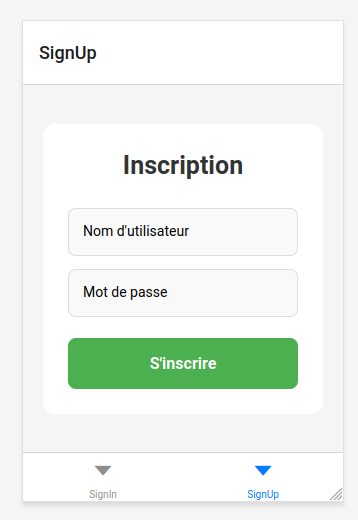
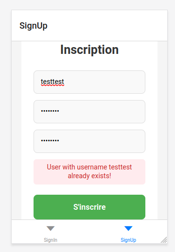
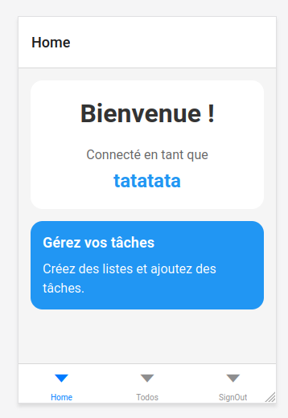
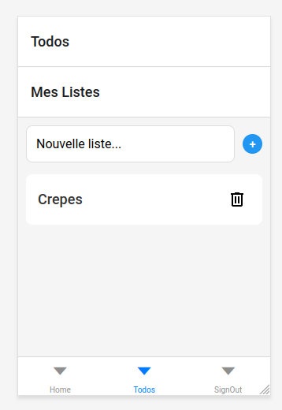
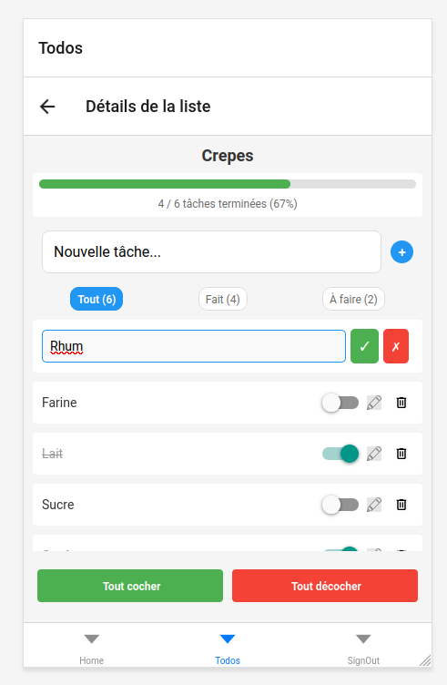
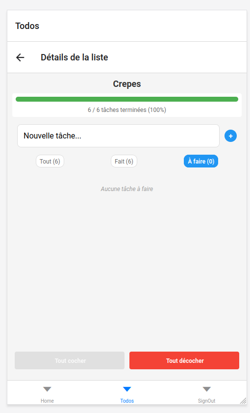
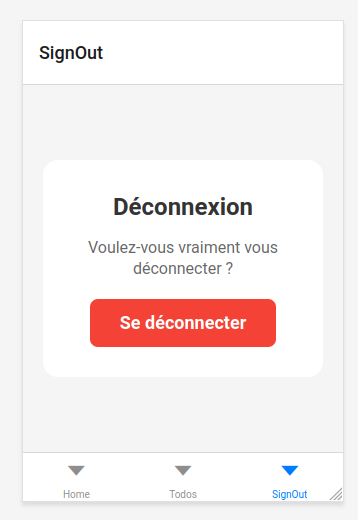

# TodoList - React
Application web pour la création et gestion de liste de tâches et de tâches.

Projet réalisé dans un cadre universitaire.
L’API utilisée est interne à l’université et n’est pas accessible publiquement.
Certaines requêtes ainsi que l’architecture générale ont été fournies et encadrées par l’enseignant.

## Fonctionnalités
- Créer un compte
- Créer une liste de tâches 
- Modifier le nom de la liste de tâches 
- Supprimer une liste de tâches
- Créer une tâche 
- Modifier le nom de la tâche 
- Supprimer une tâche
- Marquer une tâche comme terminée
- Marquer toutes les tâches comme terminées
- Marquer toutes les tâches comme non terminées
- Afficher toutes les tâches
- Afficher seulement les tâches terminées 
- Afficher seulement les tâches non terminées
- Barre de progression suivant le nombre de tâches réalisées

## Technologies
- React
- JavaScript

## Captures d'écrans

### Inscription & Authentification

### Accueil

### Gestion des tâches

### Déconnexion

## Collaboration
Projet réalisé avec :
- Vianney Marie
